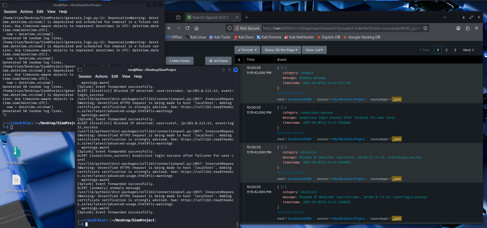

# MiniSiem-Project
A small security monitoring simulation and event correlation built with Python. Parses authentication logs, detects login bursts, suspicious logins, blocklisted IPs and performs simple anomaly detection. This forwards alerts to Splunk via HTTP Event Collector (HEC). This is a beginner friendly demonstration of SIEM and SOAR concepts.

# File Description
**mini_siem.py** - Main Python script with the detection, alerts and Splunk integration.

**generate_logs.py** - (Optional) Script to randomly generate simulated login logs.

**sample_logs.txt** - Exaple static log file for quick testing.

**alerts.log** - Output file stroing all alerts generated by the SIEM.

# VERY Basic Splunk Setup Guide
1. Splunk Enterprise (Free for 60 days): https://www.splunk.com/en_us/download/splunk-enterprise.html

2. Set up the HTTP Event Collector:
https://docs.splunk.com/Documentation/Splunk/latest/Data/UsetheHTTPEventCollector

# How to run the program once everything is ready

**To run the script with the provided sample logs:**

  python3 generate_logs.py && python3 mini_siem.py --logfile sample_logs.txt --live

**To run the "live mode" for the random log generator:**

  while true; do python3 generate_logs.py; sleep 5; done

